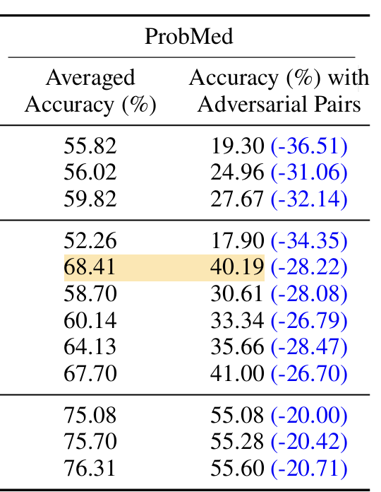

# LLaVA-Med v1.5 (Mistral) - ProbMed Benchmark Results

## Our Results

| Model | Acc w/o  Adv. Pair | Acc w. Adv. Pair | Acc. Diff |
|-------|------------------|-------------------|-----------|
| LLaVA-Med v1.5 (Mistral) | 69.41% | 38.08%| 31.33% |

## Paper Results

---

## Aggregated Results by Question Type

| Question Type | Acc (w. adv. pair) | Acc w/o Adv. Pair | Num Samples |
|---------------|-------------------|-------------------|-------------|
| Abnormality | 27.75% | - | 2,252 |
| Modality | 56.88% | 98.91% | 6,303 |
| Body Part | 60.07% | 92.80% | 6,303 |
| Entity | 21.72% | 26.13% | 6,303 |
| Grounding | 17.36% | 59.82% | 6,303 |

---

## Detailed Results by Modality and Organ

### CT Scan

| Organ | Abnormality | Modality | Modality (w/o adv) | Body Part | Body Part (w/o adv) | Entity | Entity (w/o adv) | Grounding | Grounding (w/o adv) | N |
|-------|-------------|----------|-------------------|-----------|---------------------|--------|------------------|-----------|---------------------|---|
| Abdomen | 31.43% | 49.67% | 99.60% | 57.26% | 83.75% | 14.38% | 18.11% | 20.17% | 53.22% | 751 |
| Brain | 32.35% | 47.78% | 96.67% | 65.56% | 86.67% | 15.56% | 18.52% | 16.84% | 54.21% | 270 |
| Chest | 17.65% | 45.44% | 99.45% | 61.86% | 94.53% | 17.34% | 25.91% | 15.90% | 67.74% | 548 |
| Spine | 0.00% | 44.83% | 97.70% | 54.02% | 80.46% | 9.20% | 12.64% | 17.95% | 48.72% | 87 |

### MRI

| Organ | Abnormality | Modality | Modality (w/o adv) | Body Part | Body Part (w/o adv) | Entity | Entity (w/o adv) | Grounding | Grounding (w/o adv) | N |
|-------|-------------|----------|-------------------|-----------|---------------------|--------|------------------|-----------|---------------------|---|
| Abdomen | 28.57% | 48.81% | 96.43% | 48.81% | 80.95% | 16.67% | 19.05% | 22.73% | 57.58% | 84 |
| Brain | 17.86% | 69.79% | 98.41% | 71.02% | 92.76% | 15.72% | 22.61% | 14.60% | 52.07% | 566 |
| Chest | 37.50% | 42.50% | 87.50% | 27.50% | 60.00% | 20.00% | 35.00% | 11.76% | 52.94% | 40 |
| Spine | 8.33% | 60.80% | 95.99% | 67.59% | 89.51% | 15.74% | 21.91% | 14.86% | 48.99% | 324 |

### X-Ray

| Organ | Abnormality | Modality | Modality (w/o adv) | Body Part | Body Part (w/o adv) | Entity | Entity (w/o adv) | Grounding | Grounding (w/o adv) | N |
|-------|-------------|----------|-------------------|-----------|---------------------|--------|------------------|-----------|---------------------|---|
| Abdomen | 35.00% | 52.16% | 99.14% | 42.67% | 79.31% | 13.79% | 17.24% | 15.82% | 42.94% | 232 |
| Brain | 33.33% | 45.57% | 96.20% | 20.25% | 41.77% | 16.46% | 17.72% | 17.78% | 46.67% | 79 |
| Chest | 27.98% | 60.96% | 99.58% | 60.83% | 99.13% | 27.95% | 31.25% | 17.96% | 66.09% | 3,120 |
| Spine | 50.00% | 42.57% | 98.02% | 52.97% | 89.60% | 18.32% | 24.75% | 14.37% | 44.25% | 202 |

---

## Key Observations

1. **False Premise Vulnerability**: The 31.33% accuracy drop between adversarial and non-adversarial pairs confirms significant false premise susceptibility.

2. **Modality Recognition**: High accuracy without adversarial pairs (98.91%) but drops to 56.88% with them - model struggles to reject false modality claims.

3. **Entity & Grounding are Weakest**: 
   - Entity: 21.72% (w. adv) vs 26.13% (w/o adv)
   - Grounding: 17.36% (w. adv) vs 59.82% (w/o adv)

4. **Best Performance**: X-ray chest has the most samples (3,120) and relatively consistent performance.

5. **Worst Performance**: CT scan spine (0% abnormality), MRI chest (limited samples, low body part accuracy).

---

## Model Details

- **Model**: chaoyinshe/llava-med-v1.5-mistral-7b-hf
- **Backbone**: Mistral-7B
- **Quantization**: 8-bit
- **Inference**: Batch size 1, 4 GPUs parallel